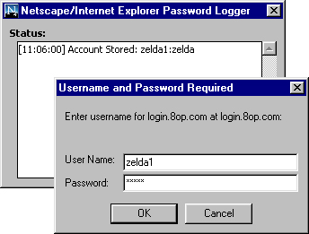



## Netscape and Internet Explorer Password Logger

### Description

This program waits for the Password Required window from either IE or Netscape to appear, then logs the username and password, as well as the server, that the user enters. VERY useful, completely commented. Please vote if you find this useful. ANY feedback is greatly appreciated.
 
### More Info
 

             |
---                |---
**Submitted On**   |2000-11-19 11:14:36
**By**             |[Patrick Moore \(Zelda\)](https://github.com/Planet-Source-Code/PSCIndex/blob/master/ByAuthor/patrick-moore-zelda.md)
**Level**          |Beginner
**User Rating**    |4.5 (18 globes from 4 users)
**Compatibility**  |VB 5\.0, VB 6\.0
**Category**       |[Miscellaneous](https://github.com/Planet-Source-Code/PSCIndex/blob/master/ByCategory/miscellaneous__1-1.md)
**World**          |[Visual Basic](https://github.com/Planet-Source-Code/PSCIndex/blob/master/ByWorld/visual-basic.md)
**Archive File**   |[CODE\_UPLOAD1183711192000\.zip](https://github.com/Planet-Source-Code/patrick-moore-zelda-netscape-and-internet-explorer-password-logger__1-12942/archive/master.zip)

